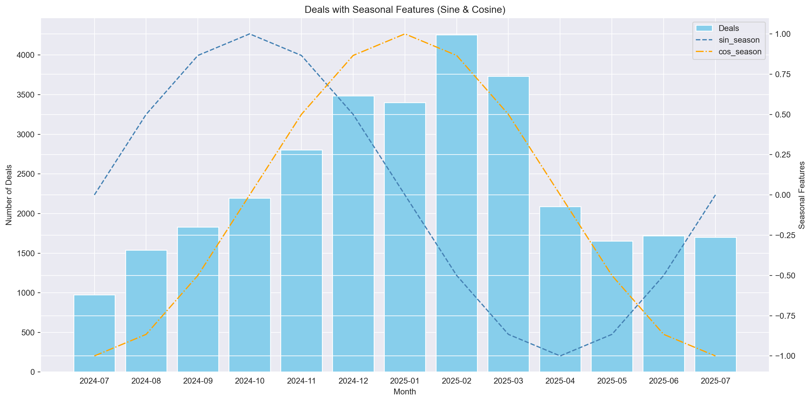
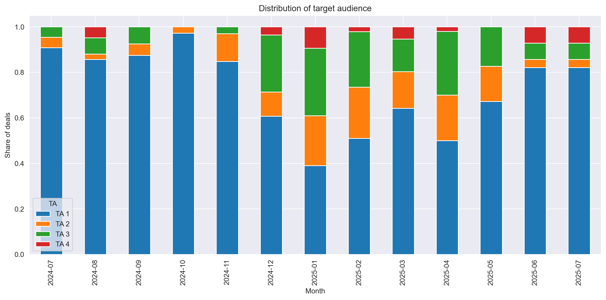
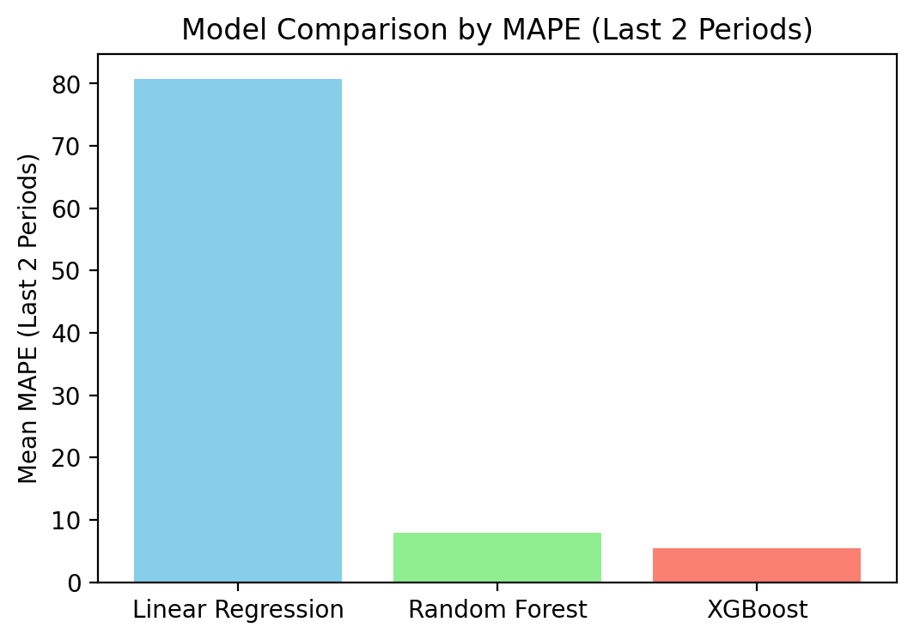
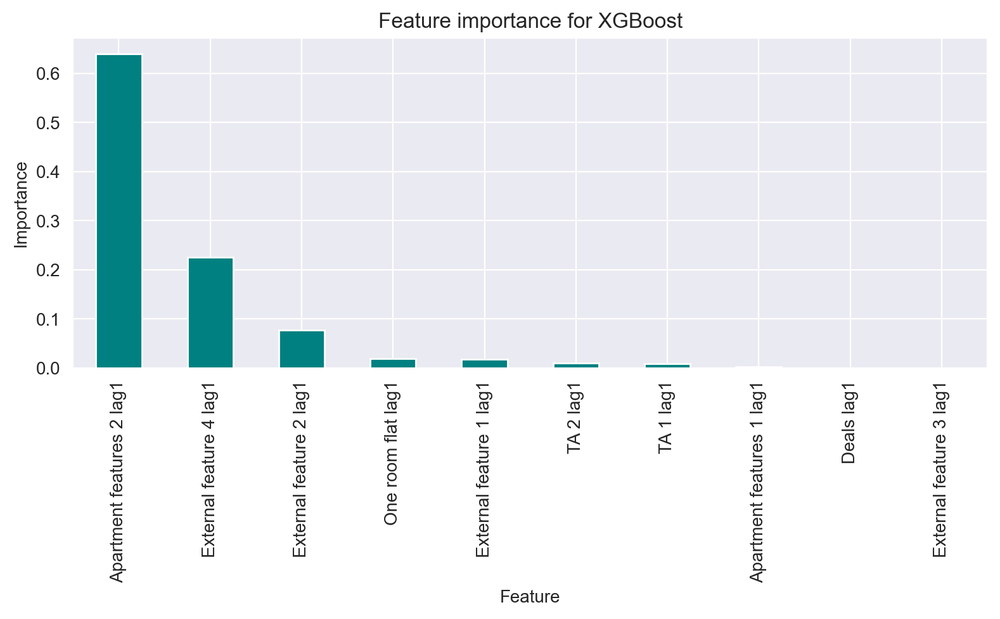
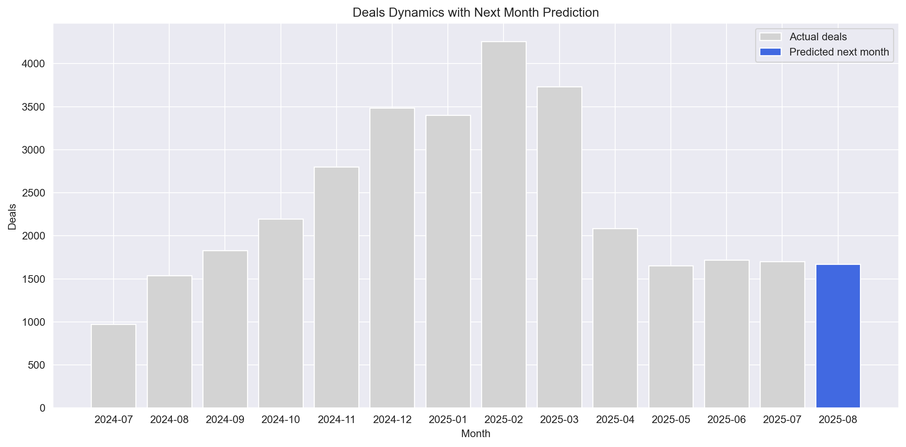
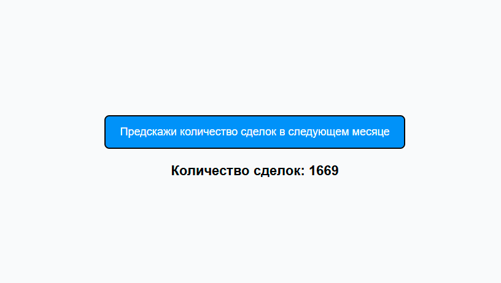

# 🏢 DemandPredictor

<p align="center">
  
</p>

<p align="center">
  
  
  
  
  
</p>

---

## 📋 О проекте

**DemandPredictor** — это ML-система для прогнозирования **количества сделок с недвижимостью** компании **ПИК в Москве** на следующий месяц. Проект создан для аналитиков и специалистов по планированию продаж, которые хотят делать обоснованные прогнозы и принимать стратегические решения на основе данных.

### 🎯 Основные возможности

- **Прогнозирование спроса**: модель предсказывает объём продаж в следующем месяце с точностью **MAPE = 5.39%**
- **Анализ влияния факторов**: учитывает целевую аудиторию, характеристики квартир, макроэкономические показатели и поисковые запросы (сентимент)
- **REST API**: простой интерфейс для получения прогнозов через FastAPI
- **Веб-визуализация**: легкая страница для демонстрации результатов
- **CLI-утилиты**: быстрый вызов обучения, предсказания и валидации модели

### 💡 Ценность для бизнеса

Модель помогает:
- **Планировать продажи** и оптимизировать маркетинговые бюджеты
- **Определять стратегию** по ЖК и сегментам аудитории
- **Понимать рыночные тренды** после ограничений на льготную ипотеку (июль 2024 – август 2025)
- **Оценивать влияние внешних факторов** (ставка ЦБ, интернет-сентимент)

---

## 📚 Навигация

- [О проекте](#-о-проекте)
- [Анализ данных](#-анализ-данных)
- [Модель и результаты](#-модель-и-результаты)
- [Установка](#-установка)
- [Использование](#-использование)
  - [CLI](#cli)
  - [API](#api)
  - [Веб-интерфейс](#веб-интерфейс)
- [Тестирование](#-тестирование)
- [Структура проекта](#-структура-проекта)
- [Roadmap](#-roadmap)
- [Контакты](#-контакты)
- [Лицензия](#-лицензия)

---

## 📊 Анализ данных

Данные покрывают период с **июля 2024** по **август 2025** (13 месяцев после ограничений на льготную ипотеку). Целевая переменная — **количество сделок** компании ПИК в Москве.

### Признаки модели

Модель использует **16 признаков**, сгруппированных по категориям:

| Категория | Признаки |
|-----------|----------|
| **🎯 Целевая аудитория** | Доли TA 1, TA 2, TA 3, TA 4 (закрытые данные) |
| **🏠 Характеристики квартир** | Средняя цена, средняя площадь |
| **📈 Внешние факторы** | Ставка ЦБ, количество поисковых запросов (4 типа) |
| **📦 Структура предложения** | Студии, 1-комнатные, 2-комнатные, 3+ комнатные |

### Визуализация данных

<p align="center">
  
  
</p>

*На графиках: сезонные колебания продаж (слева) и динамика распределения целевой аудитории по месяцам (справа).*

📖 **Подробный анализ признаков**: [feature_analysis.ipynb](notebooks/feature_analysis.ipynb)

---

## 🤖 Модель и результаты

### Сравнение моделей

Были протестированы три алгоритма:
- **Linear Regression** (базовая линия)
- **Random Forest** (ансамбль деревьев)
- **XGBoost** (градиентный бустинг) ✅

**Лучшая модель**: XGBoost с **MAPE = 5.39%**

### Ключевые графики

<p align="center">
  
  
</p>

*Слева: точность трех моделей. Справа: топ-10 признаков по важности для XGBoost.*

### Прогноз на следующий месяц

<p align="center">
  
</p>

*График: предсказанное количество сделок на сентябрь 2025 года (1669 сделок).*

📖 **Подробное исследование моделей**: [models_analysis.ipynb](notebooks/models_analysis.ipynb)

---

## 🚀 Установка

### Требования

- Python 3.12+
- pip или conda

### Клонирование репозитория

```bash
git clone https://github.com/ArtemBratyashin/DemandPredictor.git
cd DemandPredictor
```

### Установка зависимостей

```bash
pip install -r requirements.txt
```

---

## 💻 Использование

### CLI

Проект предоставляет удобные CLI-утилиты для работы с моделью:

#### Обучение модели

```bash
python main.py train --data_path data/raw_data.csv --target Deals --models_folder_path saved_models --model_name xgb_model
```

#### Получение прогноза

```bash
python main.py predict --model_folder saved_models/xgb_model
```

#### Валидация модели

```bash
---
```

---

### API

Запуск FastAPI-сервера:

```bash
uvicorn api.main:app --reload --host 127.0.0.1 --port 8000
```

#### Пример запроса

```bash
curl -X 'GET' \
  'http://127.0.0.1:8000/predict/' \
  -H 'accept: application/json'
```

#### Ответ

```json
{
  "predicted_deals": 1669
}
```

📄 **Документация API**: [http://127.0.0.1:8000/docs](http://127.0.0.1:8000/docs) (Swagger UI)

<p align="center">
  
</p>

---

### Веб-интерфейс

Откройте `frontend/index.html` в браузере для визуализации прогноза.

---

## 🧪 Тестирование

Проект покрыт тремя типами тестов:

- **Unit-тесты**: проверка отдельных функций и классов
- **Интеграционные тесты**: проверка взаимодействия модулей
- **API-тесты**: проверка эндпоинтов FastAPI

---

## 📂 Структура проекта

```
DemandPredictor/
├── api/                   # Логика API (FastAPI)
│   ├── models/            # Модели данных для валидации
│   ├── routers/           # Эндпоинты API
│   ├── config.py          # Настройки API
│   └── main.py            # Точка входа
├── data/
│   └── raw_data.csv       # Исходные данные
├── frontend/              # Веб-фронтенд (HTML/JS/CSS)
│   ├── index.html
│   ├── script.js
│   └── style.css
├── notebooks/             # Jupyter-ноутбуки
│   ├── feature_analysis.ipynb
│   ├── models_analysis.ipynb
│   └── main_plots/        # Графики для README
├── saved_models/          # Обученные модели (joblib)
│   ├── xgb_model
│   └── xgb_testing_model
├── scripts/               # CLI-утилиты
│   ├── predict_target.py
│   ├── save_model.py
│   └── validate_model.py
├── src/                   # Основная логика
│   ├── features.py
│   ├── model_trainer.py
│   ├── model_validator.py
│   ├── predictor.py
│   └── rawdata.py
├── tests/                 # Тесты
│   ├── api_tests/
│   ├── integrational_tests/
│   └── unittests/
├── LICENSE
├── README.md
├── requirements.txt
└── main.py
```

---

## 🛣️ Roadmap

Планы по развитию проекта:

- [ ] **Расширение API**: добавить эндпоинты для загрузки, просмотра и выбора данных для модели
- [ ] **Улучшение визуализации**: интерактивные графики на веб-странице (Plotly)
- [ ] **Мониторинг модели**: интеграция MLflow для трекинга экспериментов
- [ ] **SHAP-анализ**: объяснение предсказаний через важность признаков для конкретных наблюдений
- [ ] **Прогноз на несколько месяцев**: расширение горизонта предсказаний

---

## 📧 Контакты

**Автор**: Артём Братяшин

- **GitHub**: [@ArtemBratyashin](https://github.com/ArtemBratyashin)
- **Telegram**: [@Bra_Artem](https://t.me/Bra_Artem)
- **Email**: [bratiashin.aa21@physics.msu.ru](mailto:bratiashin.aa21@physics.msu.ru)
- **CV**: [ArtemBratyashin/CV.md](https://github.com/ArtemBratyashin/ArtemBratyashin/blob/main/CV.md)

---

## 📜 Лицензия

Этот проект распространяется под лицензией **MIT License**. Подробности в файле [LICENSE](LICENSE).

---

<p align="center">
  <b>⭐ Если проект был полезен, поставьте звезду! ⭐</b>
</p>
